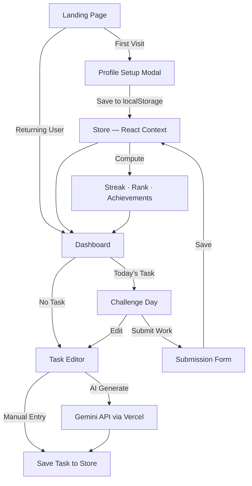

<div align="center">

# 🔥 ABTalks – 60 Day Coding Challenge

### _Build Daily. Stay Visible. Get Hired._

A fully interactive, mobile-first web application that tracks a 60-day coding challenge designed for Indian college students. Set up your profile, choose your track, add or AI-generate daily tasks, submit your work, and watch your streak grow — all data persists locally in your browser.

[](https://react.dev)
[](https://tailwindcss.com)
[](https://vite.dev)
[](https://www.framer.com/motion/)
[](https://ai.google.dev)
[](https://ab-talks-60-day-coding-challenge.vercel.app/)

[**🌐 Live Demo**](https://ab-talks-60-day-coding-challenge.vercel.app/) · [**📝 AI Usage Log**](./PROMPTS.md) · [**🐛 Report Bug**](https://github.com/suryacysec/ABTalks-60-Day-Coding-Challenge/issues)

</div>

---

## 📸 Screenshots

| Landing Page | Profile Setup | Dashboard | Task Editor |
|:---:|:---:|:---:|:---:|
| Hero with typing effect, animated counters & floating particles | Glassmorphism modal — name, college, track selection | Real streak, progress, achievements & leaderboard | Manual or AI-generated tasks with difficulty & resources |

> _The app features an animated aurora borealis background, glassmorphism cards, and smooth page transitions throughout._

---

## ✨ Features

### 👤 Profile Setup & Personalization
First-time visitors set up their profile — **name**, **college**, **branch**, and **track** — via a beautiful glassmorphism modal. Profile is saved locally and loaded on every visit.

### 🎯 4 Specialized Tracks with 80+ Curated Tasks
Choose from **Cybersecurity**, **Web Development**, **DSA & Competitive Programming**, or **AI/ML**. Each track ships with **20 curated seed tasks** ranging from Easy to Hard, auto-mapped across 60 days.

### ✏️ Task Management (Create, Edit, AI Generate)
- **Create tasks manually** — title, description, difficulty, learning objectives, resource links
- **Generate with AI** ✨ — one-click Gemini API integration fills all fields automatically
- **Edit anytime** — update any day's task before submission
- All tasks saved to `localStorage` and persist across sessions

### 📊 Interactive Dashboard (Real Data)
- **Streak tracking** with animated flame icons — computed from real submissions
- **Progress bar** with shimmer effect and milestone markers (Day 15, 30, 45, 60)
- **Dynamic achievements** — unlock badges based on actual progress (First Step, 7-Day Streak, Halfway, Legend)
- **Leaderboard** with medal icons and rank indicators
- **Difficulty curve chart** powered by Recharts
- **Personality tag** — Night Owl 🦉, Early Bird 🌅, or Afternoon Coder ☀️ based on your submission times

### 🧑‍💼 Recruiter View
Toggle a recruiter-perspective view of your profile featuring:
- GitHub-style **activity heatmap**
- Skill tags with proficiency indicators
- Summary statistics (days completed, streak, track)

### 🤖 AI Integration (Gemini API)
- **AI Post Generator** — generate professional LinkedIn posts about your daily progress
- **AI Task Generator** — generate structured coding tasks with title, description, learning outcomes, and resource links
- Powered by **Google Gemini 1.5 Flash** via a secure Vercel serverless function
- Graceful fallback when API is unavailable (works offline too!)

### 📝 Real Submission System
- Submit **GitHub commit URL** (required) and **LinkedIn post** (optional)
- Add **personal notes** about what you learned or any blockers
- Submissions are **saved to localStorage** — streak and stats auto-update
- Success screen shows your real, computed streak count

### 🏆 Dynamic Achievements System
Badges unlock automatically based on your real progress:
| Badge | Condition |
|---|---|
| 🚀 First Step | Complete 1 day |
| ✅ First Week Done | Complete 7 days |
| 🔗 GitHub Warrior | Submit 5 GitHub links |
| 👁️ LinkedIn Visible | Submit 3 LinkedIn posts |
| 🏃 Halfway There | Complete 30 days |
| 🔥 Streak Master | Maintain 14-day streak |
| 🧱 Full Stack | Complete 45 days |
| 🏆 60 Day Legend | Complete all 60 days |

### ⚡ Live Activity Feed
Auto-rotating peer activity cards with track-colored avatars showing what other challengers are building.

### 🎨 Premium Dark Theme
- Animated **aurora borealis gradient** background
- Subtle **tech dot-grid** overlay
- **Glassmorphism** cards with backdrop blur
- Smooth **Framer Motion** page transitions

### 📱 Mobile-First Design
Designed for **390px screens** first, then scales gracefully to tablet and desktop breakpoints.

---

## 🛠️ Tech Stack

| Technology | Version | Purpose |
|---|---|---|
| [React](https://react.dev) | 19 | UI framework with hooks & Context API |
| [Vite](https://vite.dev) | 8 | Lightning-fast build tool & dev server |
| [Tailwind CSS](https://tailwindcss.com) | 3.4 | Utility-first CSS framework |
| [Framer Motion](https://www.framer.com/motion/) | 13 | Declarative animations & page transitions |
| [Recharts](https://recharts.org) | 3.10 | Data visualization (difficulty chart) |
| [Lucide React](https://lucide.dev) | 1.30 | Beautiful & consistent icon library |
| [React Router](https://reactrouter.com) | 7 | Client-side routing (HashRouter) |
| [Gemini API](https://ai.google.dev) | 1.5 Flash | AI-powered task & post generation |
| localStorage | — | Client-side data persistence (no backend needed) |

---

## 🚀 Quick Start

### Prerequisites

- **Node.js** ≥ 18
- **npm** ≥ 9

### Installation

```bash
# Clone the repository
git clone https://github.com/suryacysec/ABTalks-60-Day-Coding-Challenge.git

# Navigate to the project
cd ABTalks-60-Day-Coding-Challenge

# Install dependencies
npm install

# Start the development server
npm run dev
```

Open [http://localhost:5173](http://localhost:5173) in your browser.

### Available Scripts

| Command | Description |
|---|---|
| `npm run dev` | Start Vite dev server with HMR |
| `npm run build` | Build production bundle to `dist/` |
| `npm run preview` | Preview the production build locally |
| `npm run lint` | Run OxLint for code quality checks |
| `npm run deploy` | Deploy to GitHub Pages via `gh-pages` |

---

## 📁 Project Structure

```
ABTalks-60-Day-Coding-Challenge/
├── .github/
│   └── workflows/
│       └── static.yml             # GitHub Pages CI/CD workflow
├── api/
│   └── generate-post.js           # Vercel serverless function (Gemini AI — posts + tasks)
├── public/
│   ├── favicon.svg                # App favicon
│   └── icons.svg                  # SVG icon sprite
├── src/
│   ├── components/
│   │   ├── AIPostGenerator.jsx    # AI-powered LinkedIn post generator
│   │   ├── DifficultyChart.jsx    # 60-day difficulty curve (Recharts)
│   │   ├── PeerFeed.jsx           # Live activity feed with auto-rotation
│   │   ├── ProgressBar.jsx        # Shimmer progress bar with milestones
│   │   ├── RecruiterView.jsx      # Recruiter profile view + heatmap
│   │   ├── StreakCard.jsx          # Streak counter with SVG flame animation
│   │   ├── SubmissionForm.jsx     # Real submission form — GitHub, LinkedIn, notes
│   │   ├── TaskEditor.jsx         # ✨ NEW — Create/edit tasks manually or with AI
│   │   └── Toast.jsx              # Toast notification system
│   ├── data/
│   │   ├── mock.js                # Static data (leaderboard, peer activity)
│   │   └── store.jsx              # ✨ NEW — React Context + localStorage state management
│   ├── pages/
│   │   ├── Landing.jsx            # Hero page + profile setup modal
│   │   ├── Dashboard.jsx          # Main dashboard — real stats from store
│   │   └── ChallengeDay.jsx       # Day view — task editor, submission, AI post
│   ├── App.jsx                    # Root component with StoreProvider, routing & transitions
│   ├── App.css                    # Legacy styles (kept for compatibility)
│   ├── index.css                  # Global design system & utilities
│   └── main.jsx                   # React entry point
├── index.html                     # HTML entry with SEO & Open Graph tags
├── tailwind.config.js             # Tailwind theme configuration
├── vite.config.js                 # Vite build configuration
├── vercel.json                    # Vercel deployment config (SPA rewrites)
├── postcss.config.js              # PostCSS plugin config
├── PROMPTS.md                     # AI usage log (hackathon requirement)
└── package.json                   # Dependencies & scripts
```

---

## 🧠 Architecture



### Data Flow
- **No backend required** — all user data stored in `localStorage`
- **React Context** (`StoreProvider`) wraps the entire app for global state access
- **Gemini API** calls are proxied through a Vercel serverless function for API key security
- **Computed values** (streak, rank, percentile, achievements) are derived on every render from raw submission data

---

## 🎨 Design System

| Token | Value | Usage |
|---|---|---|
| `--background` | `#0A0A0F` | Page background with aurora gradient |
| `--card` | `#13131A` | Glass card backgrounds |
| `--primary` | `#7C3AED` | Violet — main accent & CTAs |
| `--secondary` | `#3B82F6` | Blue — secondary accent & links |
| `--success` | `#10B981` | Green — completed / positive states |
| `--danger` | `#EF4444` | Red — missed / error states |
| Font | [Inter](https://fonts.google.com/specimen/Inter) (400–900) | Typography across all components |

### Visual Effects
- **Aurora Background** — A 20-second looping gradient animation with violet, blue, and emerald hues
- **Glassmorphism** — `backdrop-blur` + semi-transparent backgrounds on all cards
- **Micro-animations** — Hover scales, shimmer effects, fade-in stagger animations
- **Floating Particles** — Subtle animated dots on the landing page hero

---

## 🌍 Deployment

### Vercel (Primary — Recommended)

The app is deployed on Vercel with the AI serverless function auto-detected from `api/generate-post.js`.

**Live URL:** [https://ab-talks-60-day-coding-challenge.vercel.app/](https://ab-talks-60-day-coding-challenge.vercel.app/)

To deploy your own:
1. Import the repo on [vercel.com](https://vercel.com)
2. Add environment variable: `GEMINI_API_KEY=your_api_key_here`
3. Deploy — everything works automatically

### GitHub Pages (Static only)

Also deployed via [static.yml](.github/workflows/static.yml) on every push to `main`. Note: the AI features (task generation, post generation) require Vercel for the serverless function.

---

## 🔐 Environment Variables

| Variable | Where | Description |
|---|---|---|
| `GEMINI_API_KEY` | Vercel Dashboard | Google Gemini API key for AI task & post generation (server-side only, never exposed to client) |

> **Note:** The app is fully functional without the API key. AI features will gracefully fall back to locally generated content. All task management, submissions, and progress tracking work offline.

---

## 🤝 Contributing

Contributions are welcome! Here's how:

1. **Fork** the repository
2. **Create** a feature branch (`git checkout -b feature/amazing-feature`)
3. **Commit** your changes (`git commit -m 'Add amazing feature'`)
4. **Push** to the branch (`git push origin feature/amazing-feature`)
5. **Open** a Pull Request

---

## 📄 License

This project is open source and available under the [MIT License](LICENSE).

---

## 👨‍💻 Built By

<div align="center">

**Suryansh Gupta**
B.Tech in IT · AKGEC

[](https://github.com/suryanshinfosec)
[](https://www.linkedin.com/in/suryanshinfosec/)

---

_Built with ❤️ for the Vicodathon Hackathon · 2026_

</div>
